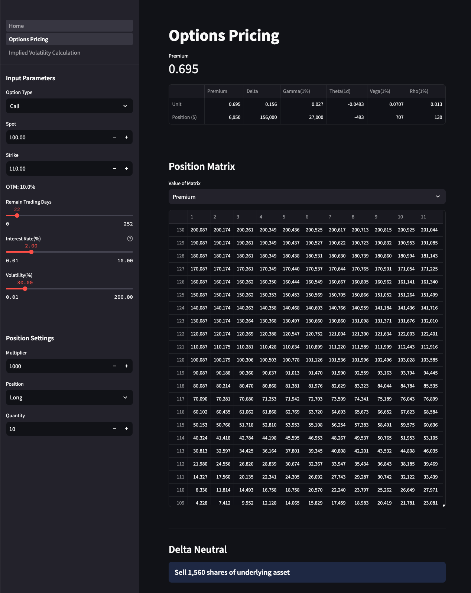

# Options Pricing Model
Option pricing models are mathematical tools used to estimate the value of financial options. These models help investors and traders determine fair prices for options, which are derivatives that give the holder the right, but not the obligation, to buy or sell an underlying asset at a predetermined price within a specified timeframe.

## Black-Scholes Pricing Model (1973)
The Black-Scholes Pricing Model, developed by Fischer Black, Myron Scholes, and Robert Merton in 1973, revolutionized the way options are priced in the financial markets. It provided a groundbreaking formula to calculate the theoretical value of European-style options. The model takes into account several factors:

1. **Underlying Asset Price (S)**: The current market price of the underlying asset.
2. **Strike Price (K)**: The predetermined price at which the option holder can buy or sell the underlying asset.
3. **Time to Expiration (T)**: The remaining time until the option's expiration.
4. **Risk-free Interest Rate (r)**: The continuously compounded risk-free interest rate over the option's time to expiration.
5. **Volatility (σ)**: The standard deviation of the underlying asset's returns, indicating the level of its price fluctuations.
Using the Black-Scholes formula, the theoretical value of a European call option (C) and a European put option (P) can be calculated as follows:


**Call Option:**
$$Call = S \cdot N(d1) - K \cdot e^{-r \cdot T} \cdot N(d2)$$

**Put Option:**
$$Put = K \cdot e^{-r \cdot T} \cdot N(-d2) - S \cdot N(-d1)$$

Where:

$$d1 = \frac{\ln\left(\frac{S}{K}\right) + \left(r + \frac{\sigma^2}{2}\right) \cdot T}{\sigma \cdot \sqrt{T}}$$

$$d2 = d1 - \sigma \cdot \sqrt{T}$$

Here, \(S\) is the underlying asset price, \(K\) is the strike price, \(T\) is the time to expiration, \(r\) is the risk-free interest rate, and \(\sigma\) is the volatility.


### Example
**Input:**
```python
from OptionsPricing import BlackScholesModel

Calculator = BlackScholesModel()

premium = Calculator.premium(s = 100, k = 105, t = 60/252, r = 0.02, sigma = 0.3, option_type = 'Call')
print(premium)
```

**Output:**
```
3.982731793716823
```
### Web UI with Streamlit



## Implied Volatility
Implied volatility is a crucial concept in options trading. It refers to the market's expectation of future volatility of the underlying asset's price, as implied by the current option prices. In other words, implied volatility represents the level of uncertainty or market sentiment about the future price movements of the underlying asset.

To calculate implied volatility, traders use the Black-Scholes formula in reverse. Given the market price of an option and all the other variables in the Black-Scholes formula (underlying price, strike price, time to expiration, risk-free rate), they iteratively solve for the volatility (σ) that would make the calculated option price match the actual market price. This involves using numerical methods, such as the Newton-Raphson method, to find the root of the equation.

Implied volatility is a valuable metric because it can provide insights into how market participants perceive potential price fluctuations. High implied volatility suggests greater uncertainty and larger expected price swings, while low implied volatility indicates calmer market expectations.

In summary, the Black-Scholes Pricing Model revolutionized options trading by providing a formula to calculate the theoretical value of options. Implied volatility, derived from the model, reflects market expectations of future price volatility. Both concepts are integral to understanding and navigating the complex world of financial derivatives.

### Example
**Input:**
```python
from OptionsPricing import calc_implied_volatility

ImpliedVol = calc_implied_volatility(s = 10046, k = 11000, t = 27/252, r = 0.02, premium = 38, option_type = 'Call')
print(ImpliedVol)
```

**Output:**
```
0.2170691314697266
```


## Greeks
The "Greeks" are a set of risk measures and sensitivities that help traders and investors understand how changes in different variables can impact the value of options. These measures are derived from the Black-Scholes model and provide valuable insights into the behavior of options under various market conditions.

Here are the main Greeks and their meanings:

### Delta (Δ): 
Delta represents the sensitivity of an option's price to changes in the underlying asset's price. It measures the rate of change in the option price for a one-unit change in the underlying asset's price. For a call option, delta ranges from 0 to 1, indicating how much the option's price moves in relation to the underlying's movement. For a put option, delta ranges from -1 to 0, indicating the inverse relationship.

### Gamma (Γ): 
Gamma measures the rate of change of an option's delta in response to changes in the underlying asset's price. It indicates how much the delta itself will change given a one-unit change in the underlying's price. Gamma is important for understanding how delta might change as the underlying's price moves.

### Theta (Θ): 
Theta represents the rate of change of an option's price with respect to the passage of time. It measures how much the option's value decreases as the time to expiration gets closer. Theta is often referred to as the "time decay" of an option.

### Vega (ν): 
Vega measures the sensitivity of an option's price to changes in the implied volatility of the underlying asset. It shows how much the option's value will change for a one-percentage-point change in implied volatility.

### Rho (ρ): 
Rho represents the sensitivity of an option's price to changes in the risk-free interest rate. It indicates how much the option's value changes in response to a one-percentage-point change in the interest rate.


These Greeks provide traders and investors with a deeper understanding of how different factors affect options' values. By analyzing the Greeks, market participants can make more informed decisions about their options strategies, manage risk exposure, and adjust their positions based on changing market conditions.

In summary, the Greeks are integral tools in options pricing, allowing traders to assess and manage the potential risks and rewards associated with various options positions.
